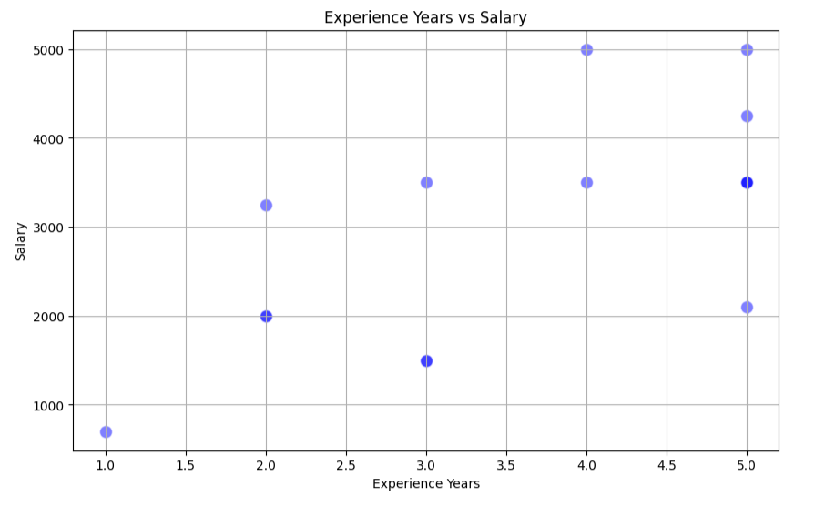
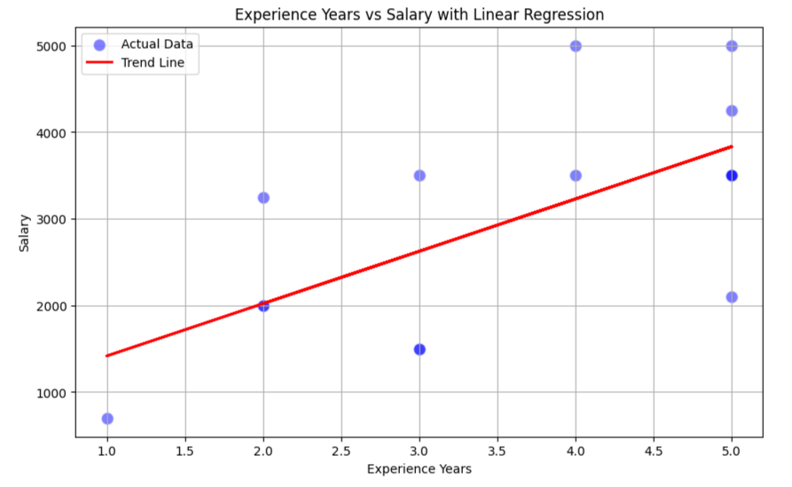
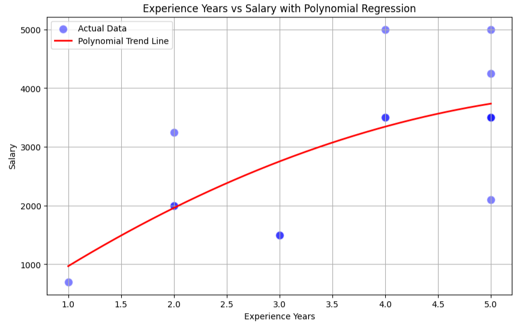
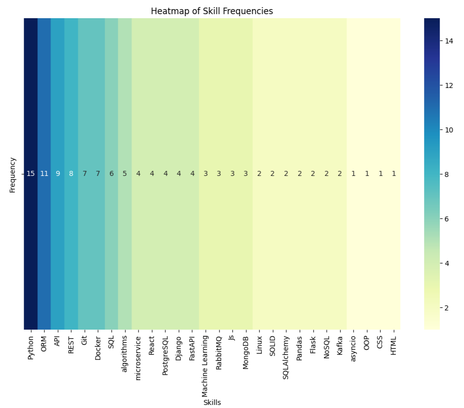
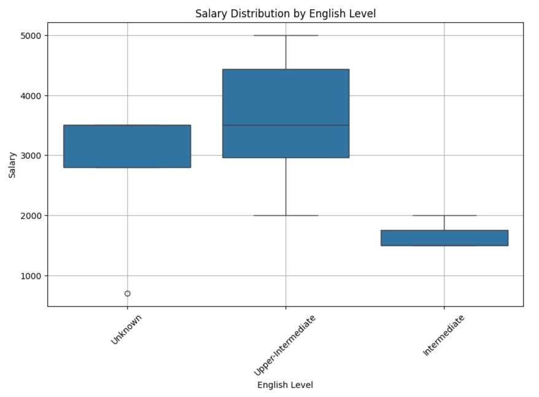
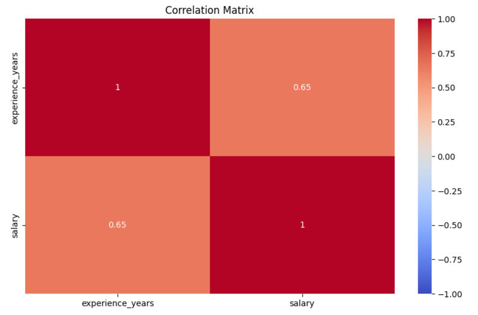

# Data Scraping and Analysis Project  

## Project Description  

This project involves scraping job vacancy data from a website, analyzing it, and visualizing various aspects  
such as salary distributions, experience requirements, and skill frequencies. The aim is to gain insights  
into the job market trends and requirements for Python-related roles.  


## To run this project, follow these steps to set up your environment:  

1. Clone the repository:
   ```bash
   git clone https://github.com/Irina17191/Scraping-DataAnalysis-project/tree/develop  
   cd Scraping-DataAnalysis-project  
   ```

2. Create a Virtual Environment:
   ```bash
   python -m venv venv
   source venv/bin/activate  # On Macos
   venv\Scripts\activate  # On Windows
   ```

3. Install the required packages:
    ```bash
   pip install -r requirements.txt
   ```

4. Download the Data:

Make sure you have access to the website from which data is being scraped  
or have the data available locally.


## Usage


1. Run the Scraping Script   
This script will scrape job vacancy data and save it to vacancies.csv.  
    ```bash
   python scraper/scraper.py
   ```

2. Run the Analysis Script:
This script will load the vacancies.csv file, 
perform data cleaning and analysis, and generate visualizations.
    ```bash
   cd data_analysis
   jupyter notebook
   ```
Open main.ipynb from the Jupyter interface and run the cells.  


## Examples:  
# Frequency of Skills in Job Vacancies  

 

# Experience Years vs Salary



# Experience Years vs Salary with Linear Regression



# Experience Years vs Salary with Polynomial Regression



# Heatmap of Skill Frequencies



# Salary Distribution by English Level



# Correlation Matrix



